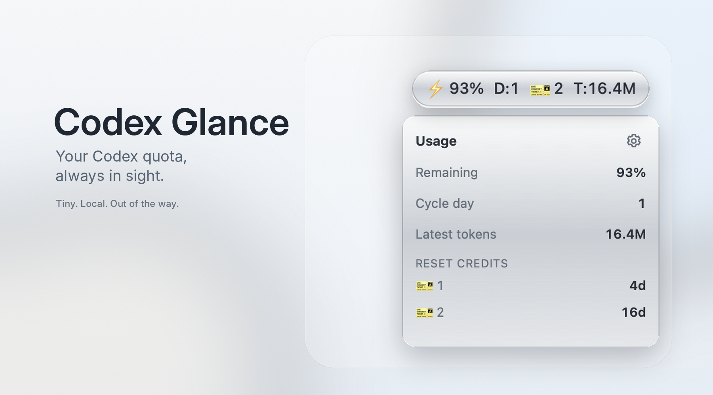
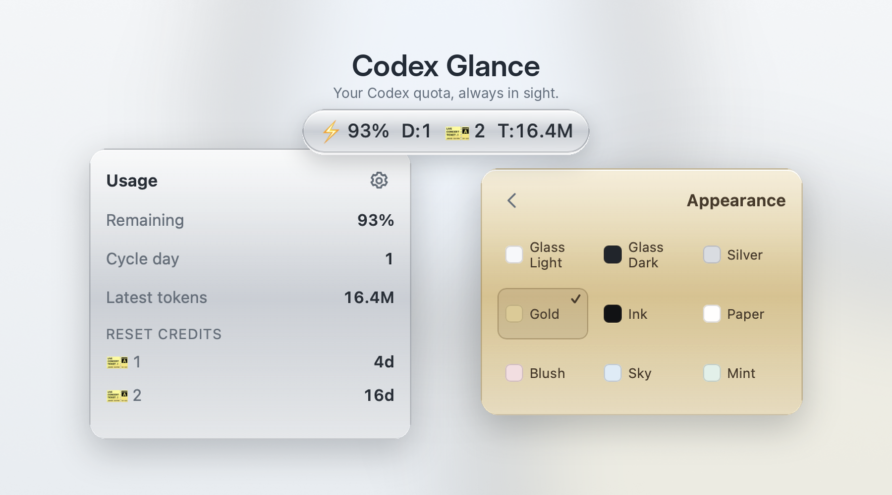
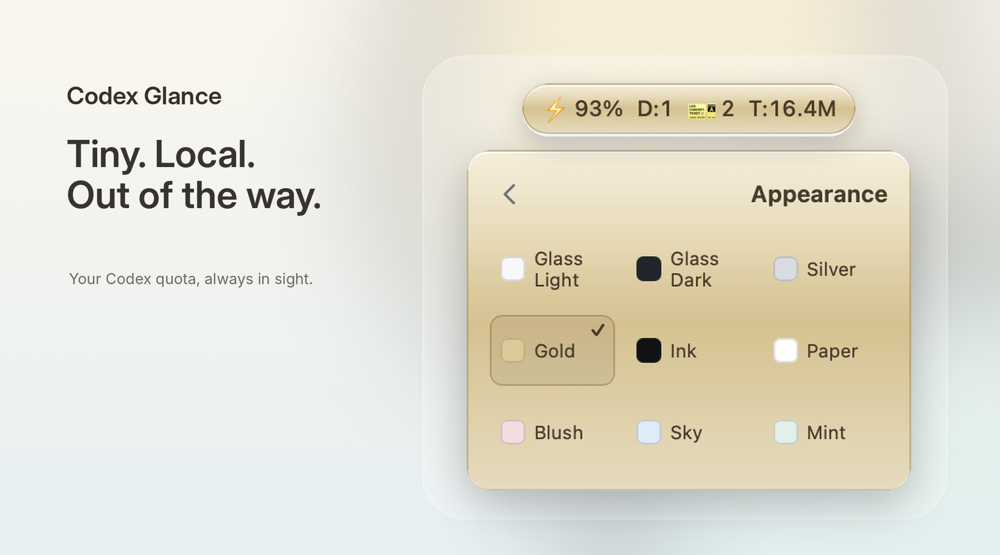

# Codex Glance

**Your Codex quota, always in sight.**

Codex can show your usage. Getting there takes too many clicks.

Codex Glance keeps the useful numbers on screen in one small floating pill.



[Download the latest macOS release](https://github.com/okichen168/codex-glance/releases/latest) · [DMG](https://github.com/okichen168/codex-glance/releases/latest/download/Codex-Glance-macOS-arm64.dmg) · [ZIP](https://github.com/okichen168/codex-glance/releases/latest/download/Codex-Glance-macOS-arm64.zip)

Free to download and use. Codex Glance is the official compiled macOS application distributed from this repository; its source code is not publicly distributed.

## At a glance

```text
⚡93%   D:1   🎫2   T:16.4M
```

- ⚡ Remaining quota
- D Current cycle day
- 🎫 Available reset credits
- T Latest valid token bucket

Hover for details. Click the ticket to see each expiry. Drag the pill wherever it fits.



## Why

No dashboard to keep reopening. No reset credit quietly expiring. No Dock clutter.

The numbers you check, already there.

## Themes

Glass, metal, dark, light, and soft color themes. Pick one from the same compact panel.



## Fast when Codex is slow

The last good snapshot appears first. Codex Glance refreshes quietly in the background and keeps old data visible when the local service is temporarily unavailable.

Use the refresh icon in the Usage panel for an immediate update.

## Privacy

Codex Glance uses the local official `codex app-server`. It reads only usage information needed to show your quota and does not read cookies, access tokens, chats, or source code. Nothing is uploaded. See [PRIVACY.md](PRIVACY.md).

## Requirements and installation

- macOS 11 or later on Apple Silicon. An Intel build is not included in this release.
- The official Codex CLI or Codex desktop app must already be installed and signed in.
- Download the [DMG](https://github.com/okichen168/codex-glance/releases/latest/download/Codex-Glance-macOS-arm64.dmg), open it, and drag **Codex Glance** to Applications. The [ZIP](https://github.com/okichen168/codex-glance/releases/latest/download/Codex-Glance-macOS-arm64.zip) contains the same app as an alternate archive.

The first release is not commercially code-signed or notarized. macOS may show a Gatekeeper warning. Download only from this official release page, verify the value in `SHA256SUMS.txt`, then Control-click the app in Finder, choose **Open**, and confirm **Open**.

## Source and licensing

This public repository contains the official compiled application, release checksums, product documentation, and public screenshots only. It does not publish source code, build configuration, tests, or development scripts.

Codex Glance is not licensed under MIT. See [LICENSE](LICENSE), [END_USER_LICENSE.md](END_USER_LICENSE.md), [SECURITY.md](SECURITY.md), and [THIRD_PARTY_NOTICES.md](THIRD_PARTY_NOTICES.md) for the applicable terms and notices.

## Unofficial disclaimer

Codex Glance is unofficial and is not affiliated with OpenAI.
